# YouTube Alternative PWA - 技術文檔

## 目錄
1. [系統架構概述](#系統架構概述)
2. [資料庫模型關聯圖](#資料庫模型關聯圖)
3. [後端 API 功能說明與流程圖](#後端-api-功能說明與流程圖)
4. [前端 UI/UX 操作流程](#前端-uiux-操作流程)

---

## 系統架構概述

```
┌─────────────────────────────────────────────────────────────────┐
│                        Frontend (React + Vite)                   │
│  ┌─────────┐ ┌─────────┐ ┌─────────┐ ┌─────────┐ ┌─────────┐  │
│  │  Home   │ │  Watch  │ │ Search  │ │History  │ │Playlists│ │
│  └────┬────┘ └────┬────┘ └────┬────┘ └────┬────┘ └────┬────┘  │
└───────┼──────────┼──────────┼──────────┼──────────┼──────────┘
        │           │          │          │          │
        └───────────┴──────────┴──────────┴──────────┘
                            │
                    Vite Proxy (5173)
                            │
┌───────────────────────────┴───────────────────────────────────┐
│                       Backend (FastAPI)                         │
│  ┌──────────┐ ┌──────────┐ ┌──────────┐ ┌──────────┐         │
│  │  Video   │ │  Search  │ │  User    │ │Playlist  │         │
│  │  Router  │ │  Router  │ │  Router  │ │  Router  │         │
│  └────┬─────┘ └────┬─────┘ └────┬─────┘ └────┬─────┘         │
└───────┼────────────┼────────────┼────────────┼────────────────┘
        │            │            │            │
   ┌────┴────┐  ┌────┴────┐  ┌────┴────┐  ┌────┴────┐
   │ yt-dlp  │  │Invidious│  │SQLAlchemy│  │ Redis   │
   │ Service │  │ Service │  │   DB     │  │ Cache   │
   └─────────┘  └─────────┘  └──────────┘  └─────────┘
```

---

## 資料庫模型關聯圖

### ER 關聯圖

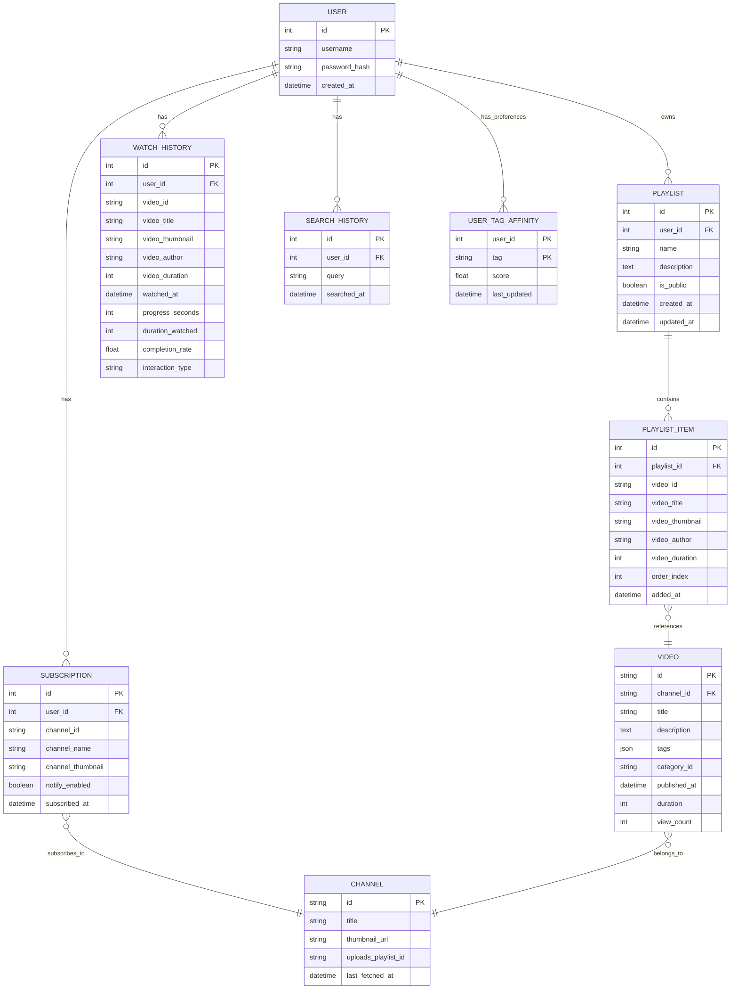

### 資料表說明

| 資料表 | 用途說明 |
|--------|----------|
| `users` | 存放使用者帳號資訊 |
| `playlists` | 使用者建立的播放清單 |
| `playlist_items` | 播放清單中的影片項目 |
| `watch_history` | 使用者的觀看歷史記錄 |
| `search_history` | 使用者的搜尋歷史記錄 |
| `subscriptions` | 使用者訂閱的頻道 |
| `channels` | YouTube 頻道資訊快取 |
| `videos` | YouTube 影片資訊快取 |
| `user_tag_affinity` | 使用者興趣標籤親和度 |

---

## 後端 API 功能說明與流程圖

### API 路由總覽

```
/api/video     - 影片相關 API
/api/search     - 搜尋相關 API
/api/user      - 使用者認證 API
/api/playlists - 播放清單 API
/api/history   - 觀看歷史 API
/api/subscriptions - 訂閱相關 API
/api/feed      - 個人化推薦 API
/api/search-history - 搜尋歷史 API
```

---

### 1. Video API (`/api/video`)

#### API 端點

| 方法 | 路徑 | 功能說明 |
|------|------|----------|
| GET | `/info/{video_id}` | 獲取影片詳細資訊 |
| GET | `/stream/{video_id}` | 獲取串流 URL（重定向） |
| GET | `/audio/{video_id}` | 獲取純音訊串流（背景播放） |
| GET | `/merge` | 合併影片與音訊串流（FFmpeg） |
| GET | `/related/{video_id}` | 獲取相關影片推薦 |
| GET | `/proxy` | 代理外部內容（避免 CORS） |

#### 流程圖：獲取影片資訊

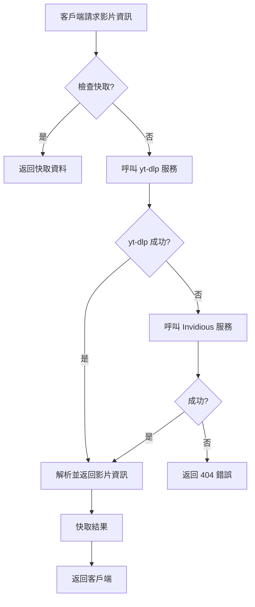

#### 流程圖：影片串流合併

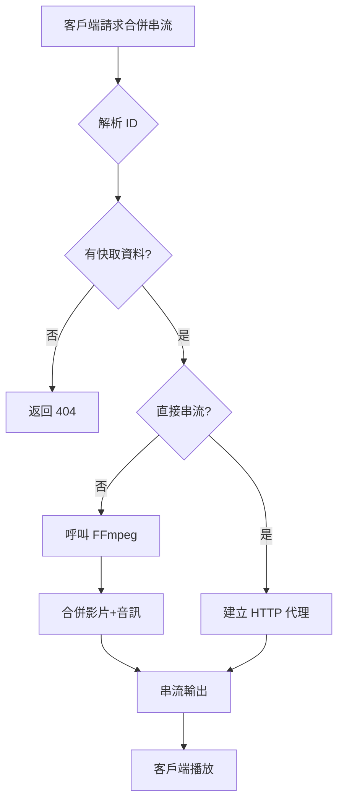

---

### 2. Search API (`/api/search`)

#### API 端點

| 方法 | 路徑 | 功能說明 |
|------|------|----------|
| GET | `/` | 搜尋 YouTube 影片 |
| GET | `/trending` | 獲取熱門影片 |
| GET | `/suggestions` | 獲取搜尋建議 |
| GET | `/related` | 獲取關聯推薦 |

#### 流程圖：搜尋影片

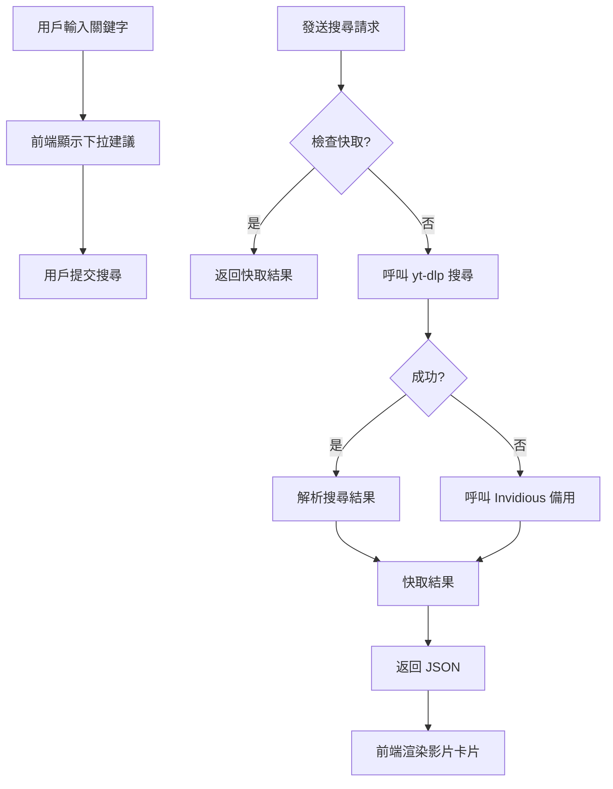

---

### 3. User API (`/api/user`)

#### API 端點

| 方法 | 路徑 | 功能說明 |
|------|------|----------|
| POST | `/register` | 使用者註冊 |
| POST | `/login` | 使用者登入 |
| GET | `/me` | 取得當前用戶資訊 |

#### 流程圖：使用者認證

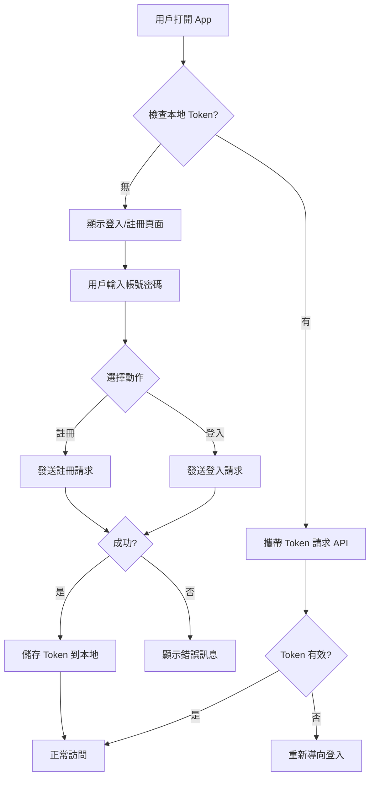

---

### 4. Playlist API (`/api/playlists`)

#### API 端點

| 方法 | 路徑 | 功能說明 |
|------|------|----------|
| GET | `/` | 取得用戶所有播放清單 |
| POST | `/` | 建立新播放清單 |
| GET | `/{playlist_id}` | 取得單一播放清單 |
| GET | `/{playlist_id}/items` | 取得播放清單項目 |
| POST | `/{playlist_id}/items` | 新增影片到播放清單 |
| DELETE | `/{playlist_id}/items/{item_id}` | 移除播放清單項目 |
| DELETE | `/{playlist_id}` | 刪除播放清單 |
| PUT | `/{playlist_id}` | 更新播放清單 |
| POST | `/import` | 匯入 YouTube 播放清單 |

#### 流程圖：新增影片到播放清單

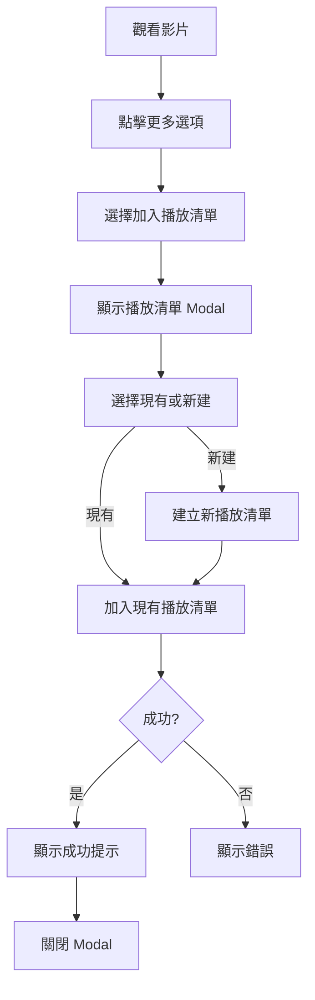

---

### 5. History API (`/api/history`)

#### API 端點

| 方法 | 路徑 | 功能說明 |
|------|------|----------|
| GET | `/` | 取得觀看歷史 |
| POST | `/` | 新增觀看記錄 |
| DELETE | `/{user_id}/{video_id}` | 刪除單筆記錄 |
| DELETE | `/{user_id}/clear` | 清除所有歷史 |

#### 流程圖：記錄觀看歷史

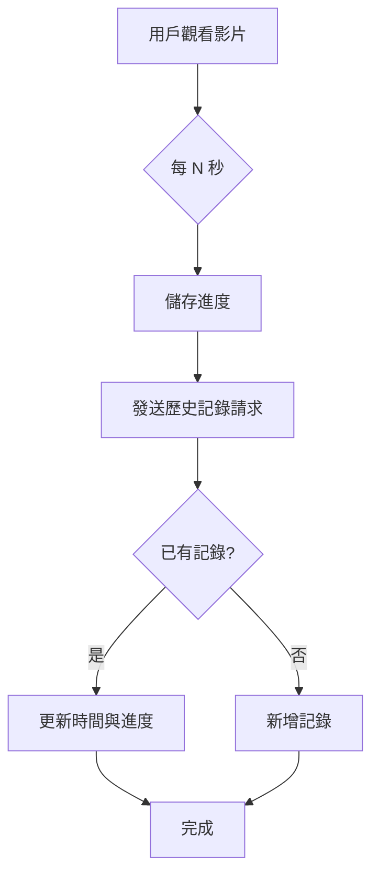

---

### 6. Subscription API (`/api/subscriptions`)

#### API 端點

| 方法 | 路徑 | 功能說明 |
|------|------|----------|
| GET | `/` | 取得所有訂閱 |
| GET | `/status/{channel_id}` | 檢查訂閱狀態 |
| POST | `/` | 訂閱頻道 |
| DELETE | `/{channel_id}` | 取消訂閱 |
| GET | `/feed` | 取得訂閱更新動態 |
| PUT | `/{channel_id}/notify` | 切換通知 |
| GET | `/notifications` | 取得通知 |

#### 流程圖：訂閱頻道

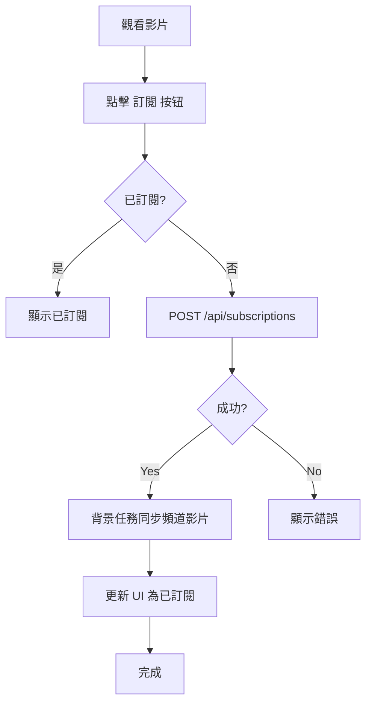

---

### 7. Feed API (`/api/feed`)

#### API 端點

| 方法 | 路徑 | 功能說明 |
|------|------|----------|
| GET | `/` | 取得個人化推薦 |
| POST | `/sync` | 手動觸發同步 |
| POST | `/refresh-profile` | 刷新興趣檔案 |

#### 流程圖：個人化推薦

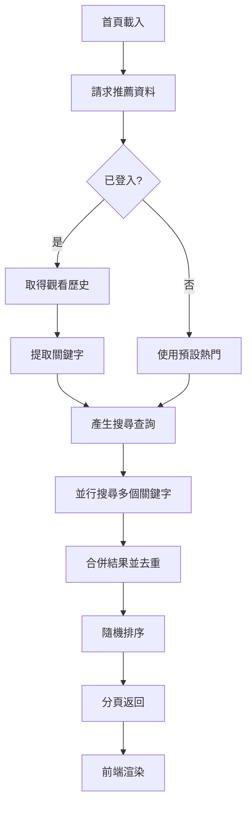

---

### 8. Search History API (`/api/search-history`)

#### API 端點

| 方法 | 路徑 | 功能說明 |
|------|------|----------|
| GET | `/` | 取得搜尋歷史 |
| POST | `/` | 新增搜尋記錄 |
| DELETE | `/` | 清除所有搜尋歷史 |
| DELETE | `/{id}` | 刪除單筆記錄 |

---

## 前端 UI/UX 操作流程

### 頁面結構

```
App
├── Navbar (頂部導航)
│   ├── 搜尋框
│   ├── Logo
│   └── 使用者頭像
├── Routes
│   ├── Home (首頁/推薦)
│   ├── Watch (觀看頁面)
│   ├── Search (搜尋結果)
│   ├── History (觀看歷史)
│   ├── Playlists (播放清單)
│   ├── PlaylistDetail (播放清單詳情)
│   ├── Subscriptions (訂閱列表)
│   ├── Notifications (通知)
│   ├── Profile (個人資料)
│   └── Auth (登入/註冊)
└── BottomNav (底部導航 - 行動版)
```

### 操作流程圖

#### 1. 首頁載入流程

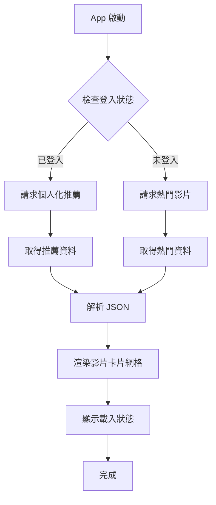

#### 2. 搜尋流程

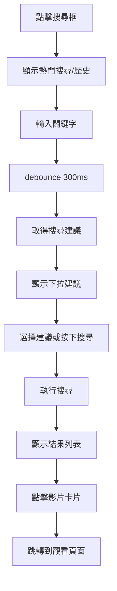

#### 3. 觀看影片流程

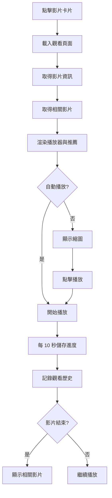

#### 4. 播放清單流程

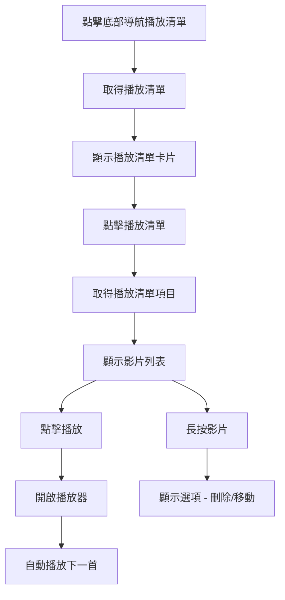

#### 5. 訂閱流程

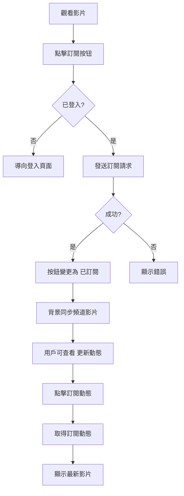

---

### 底部導航 (BottomNav)

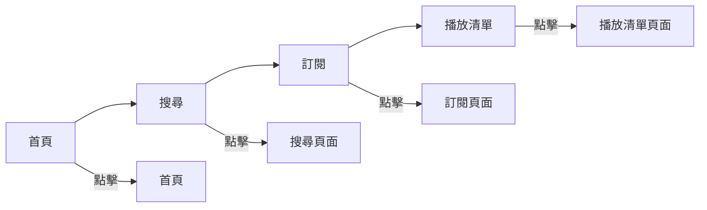

---

## 技術堆疊總覽

| 層面 | 技術 |
|------|------|
| 前端框架 | React 18 + Vite |
| 前端路由 | React Router v6 |
| 後端框架 | FastAPI (Python) |
| 資料庫 | PostgreSQL + SQLAlchemy (非同步) |
| 快取 | Redis |
| 影片擷取 | yt-dlp + Invidious |
| 影片處理 | FFmpeg |
| 認證 | JWT (Mock 實現) |

---

## 常見使用情境

### 情境 1：背景播放音樂
```
1. 用戶在 Watch 頁面
2. 切換到音訊模式
3. API: GET /api/video/audio/{video_id}
4. 返回純音訊 URL
5. 手機切到背景 Audio 繼續播放
```

### 情境 2：匯入 YouTube 播放清單
```
1. 用戶在 Playlists 頁面
2. 點擊 匯入
3. 貼上 YouTube 播放清單 URL
4. API: POST /api/playlists/import
5. 後端使用 yt-dlp 抓取所有影片
6. 建立本地播放清單
```

### 情境 3：個人化推薦
```
1. 用戶觀看越多影片
2. 系統記錄觀看歷史與標籤
3. API: GET /api/feed
4. 基於興趣標籤搜尋相關影片
5. 返回個人化推薦列表
```

---

## 附錄：環境變數

```
# Backend
DATABASE_URL=postgresql+asyncpg://...
REDIS_URL=redis://...
JWT_SECRET=your-secret-key

# Frontend (Vite)
VITE_API_URL=http://localhost:8000
```

---

*文檔版本: 1.0.0*
*最後更新: 2026-02-22*
